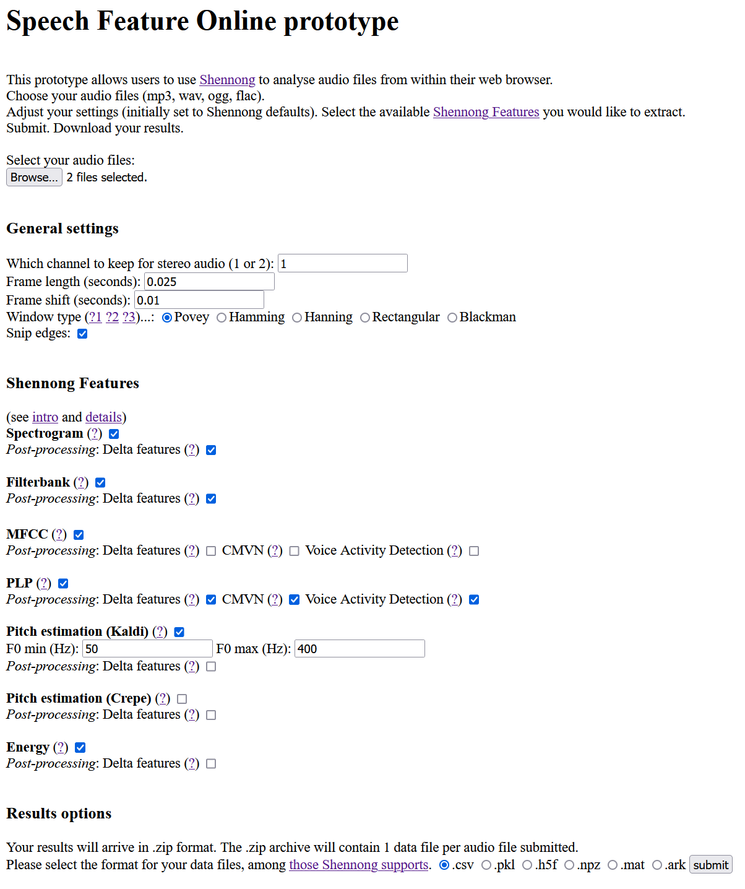

# Speech Feature Online

This repo contains a prototype for Speech Feature Online, a web interface that allows users to take advantage of Shennong and other speech analysis tools without having to learn Python or install anything on their own machine.

### How it's made

Speech Feature Online is built with [FastAPI](https://fastapi.tiangolo.com)'s many functionalities, and offers a decent portion of [Shennong](https://docs.cognitive-ml.fr/shennong/)'s features. There are plans to add wav2vec functionality alongside Shennong in the future.    
In order to host SFO, a Python environment with FastAPI and Shennong installed is necessary. Once SFO is up and running, a web browser is all you need to be able to use it.  

  
  
Once you have a Python environment with the aforementioned dependencies installed:  
*(And once the program's rocky start bugs have been fixed up...)*
  
  1. Open a command shell
  2. Navigate to ~/speech_feature_online/  
  3. In your shell, type in:  
      `$ python -m uvicorn prototype:app`  
  4. In your browser of choice, navigate to the address the shell/Uvicorn gives you + `/home`
  5. Enjoy SFO!
  
### The pesky dependencies

FastAPI is actually not pesky at all, but do beware that Shennong is not compatible with Windows - only UNIX.  
If you're on Windows, like the author of this program, you can work around this through the Ubuntu Subsystem. This is easy enough if you [mount the virtual Ubuntu as a "network drive"](https://gunnarpeipman.com/browse-wsl-with-explorer/) on your Windows machine. From there, UNIX installation should proceed as normal, and you can use the subsystem terminal to run SFO.
  
### Table of contents  
  
`prototype.py` : the all-in-one script with Shennong implementation and front page FastAPI app  
  
  * `analyser (file: str, subdir: str, fts: list, settings: dict)`: takes audio file and user-specified settings and performs Shennong analysis on the file, saving results to disk  
      * results are collected **per audio file**: example.wav → example_features.csv {example_spectrogram, example_mfcc, example_pitch_kaldi, ...}  
	  and **not** per feature: example1.wav, example2.wav → mfcc.csv {example1_mfcc, example2_mfcc}  
	  * per-feature analysers are an option for the future, but they'd require re-thinking CMVN post-processing (which needs a collection of features per audio file)
  * FastAPI `/home` page: takes audio file & user specified settings, passes them to `analyser`, returns .zip file with results  
      * audio files submitted are erased by the time the results file is returned
  
`/templates` : HTML templates used by FastAPI   
`/tmp` : folder used for file storage. New random-name subfolder is created + erased over the course of each user request. Subfolder `/results` (collecting results) at present needs to be manually cleared every so often.